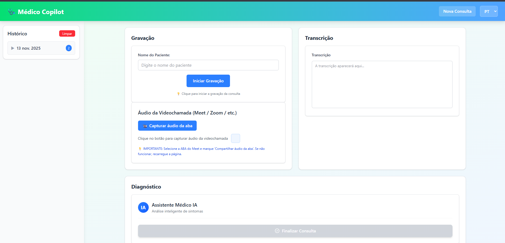
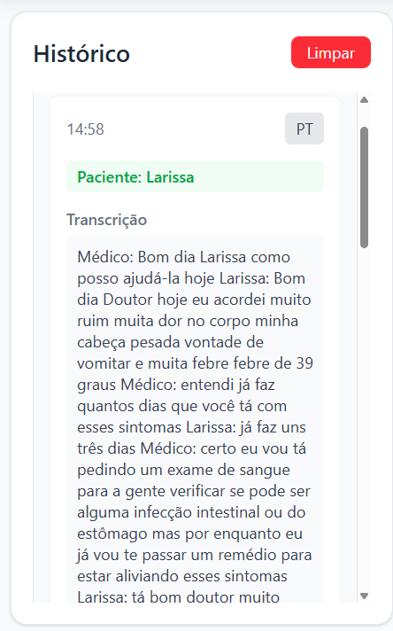

# 🩺 MedNote - Assistente Médico com IA

Uma aplicação web moderna que utiliza inteligência artificial para auxiliar profissionais de saúde na documentação e análise de consultas médicas, oferecendo transcrição de voz em tempo real e geração de diagnósticos assistidos por IA.

##  Funcionalidades

- 🎙️ **Gravação de Áudio em Tempo Real**: Capture consultas médicas com transcrição automática
- 🤖 **Diagnóstico Assistido por IA**: Análise inteligente dos sintomas e geração de possíveis diagnósticos
- 💬 **Chat Interativo**: Converse com a IA para esclarecer dúvidas sobre o diagnóstico
- 📹 **Captura de Chamada de Vídeo**: Grave e documente consultas por videochamada
- 📋 **Histórico de Consultas**: Armazene e acesse consultas anteriores
- 🌐 **Suporte Multilíngue**: Interface disponível em português e inglês
- 📱 **Design Responsivo**: Interface otimizada para desktop e dispositivos móveis

##  Screenshots


### Tela Principal



### Diagnóstico por IA


### Histórico de Consultas



##  Tecnologias Utilizadas

- **Frontend**: 
  - React 18 com TypeScript
  - Vite (build tool)
  - Tailwind CSS para estilização
  - Hooks customizados para gerenciamento de estado

- **Funcionalidades**:
  - Web Speech API para reconhecimento de voz
  - API REST para comunicação com backend
  - LocalStorage para histórico local
  - Streaming de dados para diagnósticos em tempo real

## 🚀 Pré-requisitos

Antes de começar, certifique-se de ter instalado em sua máquina:

- [Node.js](https://nodejs.org/) (versão 18 ou superior)
- [npm](https://www.npmjs.com/) ou [yarn](https://yarnpkg.com/)

## ⚙️ Instalação

1. **Clone o repositório**
   ```bash
   git clone https://github.com/PolyannaMeira/MedNote-FrontEnd.git
   cd MedNote-FrontEnd
   ```

2. **Instale as dependências**
   ```bash
   npm install
   ```

3. **Configure as variáveis de ambiente**
   ```bash
   # Crie um arquivo .env.local na raiz do projeto
   cp .env.example .env.local
   
   # Edite o arquivo com suas configurações
   VITE_API_URL=http://localhost:3001
   ```

4. **Execute a aplicação em modo de desenvolvimento**
   ```bash
   npm run dev
   ```

5. **Acesse a aplicação**
   ```
   http://localhost:5173
   ```

##  Scripts Disponíveis

```bash
# Desenvolvimento
npm run dev          # Inicia servidor de desenvolvimento

# Build
npm run build        # Cria build de produção
npm run preview      # Preview do build de produção
```

##  Estrutura do Projeto

```
src/
├── components/           # Componentes React reutilizáveis
│   ├── ChatIA.tsx       # Chat interativo com IA
│   ├── DiagnoseView.tsx # Visualização de diagnósticos
│   ├── HistoryDrawer.tsx # Histórico de consultas
│   ├── RecorderClean.tsx # Gravador de áudio
│   ├── TranscriptView.tsx # Visualização de transcrição
│   └── VideoCallCapture.tsx # Captura de videochamada
├── hooks/               # Hooks customizados
│   └── useVoiceAI.ts   # Hook para funcionalidades de voz
├── lib/                 # Utilitários e configurações
│   ├── api.ts          # Configurações de API
│   ├── history.ts      # Gerenciamento de histórico
│   ├── i18n.ts         # Internacionalização
│   └── types.ts        # Definições de tipos TypeScript
├── App.tsx             # Componente principal
├── main.tsx            # Ponto de entrada da aplicação
└── index.css           # Estilos globais
```

##  Configuração

### API Backend

A aplicação requer um backend para funcionar completamente. Configure a URL da API no arquivo de ambiente:

```env
VITE_API_URL=https://sua-api-backend.com
```

### Permissões do Navegador

Para utilizar a funcionalidade de gravação de áudio, o navegador solicitará permissão para acessar o microfone. Certifique-se de permitir o acesso quando solicitado.

## Como Usar

1. **Iniciar Nova Consulta**: Clique em "Iniciar" para começar a gravar
2. **Transcrição em Tempo Real**: Fale normalmente durante a consulta
3. **Finalizar Consulta**: Clique em "Finalizar Consulta" para processar
4. **Analisar Diagnóstico**: Revise o diagnóstico gerado pela IA
5. **Interagir com IA**: Use o chat para esclarecer dúvidas
6. **Salvar no Histórico**: A consulta é automaticamente salva

##  Contribuindo

1. Faça um fork do projeto
2. Crie uma branch para sua feature (`git checkout -b feature/AmazingFeature`)
3. Commit suas mudanças (`git commit -m 'Add some AmazingFeature'`)
4. Push para a branch (`git push origin feature/AmazingFeature`)
5. Abra um Pull Request


**Polyanna Meira**
- GitHub: [@PolyannaMeira](https://github.com/PolyannaMeira)
- LinkedIn: [Polyanna Meira](https://linkedin.com/in/polyanna-meira)


